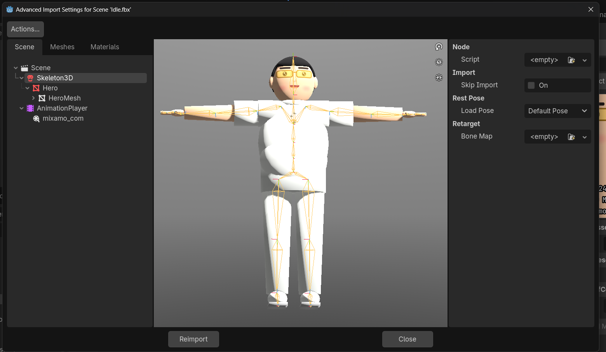

# Temple Quest – Lab 6 🛕

ตัวละคร 3D สไตล์การ์ตูน → **Blender** → rig ด้วย **Mixamo** → ใส่ท่าทางจาก **Godot4-OpenAnimationLibraries** (Melee + Shooter) → ใช้เป็น Player ในเกม 3D → Export เป็น **Web**

▶️ **เล่นบนเว็บ:** https://USERNAME.github.io/GameLab6/  ← (แก้ USERNAME หลังเปิด GitHub Pages)

**ผู้จัดทำ** — รหัส: 673380350-7 · ชื่อ-สกุล: สิทธิพงษ์ นครขวาง · กลุ่มเรียน: AI 1

## เกม
ด่าน platform ธีมวัดไทย/ป่าเขตร้อน: เก็บเหรียญ 12 เหรียญ, ฟันไหดิน 6 ใบ, checkpoint, แพลตฟอร์มเคลื่อนที่, ไปให้ถึงเจดีย์ทอง

**Controls:** WASD เดิน · Shift วิ่ง · Space กระโดด · คลิก/J โจมตี · Q หลบ(กลิ้ง) · E ดีใจ · R เริ่มใหม่ · Esc หยุด · M ปิด/เปิดเสียง

**เสียง:** เพลงประกอบสไตล์ไทย (ระนาด + ฉิ่ง + กลอง) วนซ้ำ และเสียงเอฟเฟกต์ เดิน/กระโดด/ลงพื้น/ฟัน/กลิ้ง/เก็บเหรียญ/ไหแตก/checkpoint/ตกน้ำ/ชนะ/กดปุ่ม — สังเคราะห์ขึ้นเองทั้งหมด (`lab-6/assets/audio/`)

## ภาพหน้าจอ
### 1. Blender3D – การสร้างตัวละคร

### 2. Mixamo – นำเข้าตัวละครทำ Animation

### 3. Godot – แก้ไขตัวละครใน Editor

### 4. Godot – หน้าจอขณะเล่น


---

## ขั้นตอนทำตัวละคร

### 1) Blender
1. เปิด Blender → **File > New > General**
2. แท็บ **Scripting** → **Text > Open…** → `lab-6/blender/make_character.py` → **Run Script ▶**
3. ได้ `lab-6/blender/hero_for_mixamo.fbx` (+ `hero_character.blend`) — ตัวละครท่า T-Pose หน้าการ์ตูน (แว่นเหลือง ผมดำ เสื้อโปโลขาว)

### 2) Mixamo
1. https://www.mixamo.com → **Upload Character** → `hero_for_mixamo.fbx`
2. วางจุด Chin, Wrists, Elbows, Knees, Groin → Skeleton **Standard (65)** → Next
3. เลือกท่า 1 ท่า (เช่น Idle) → **Download**: FBX Binary, **With Skin**, 30 fps
4. เปลี่ยนชื่อเป็น **`hero.fbx`** → วางใน `lab-6/characters/`

### 3) Animation Library
จาก https://github.com/catprisbrey/Godot4-OpenAnimationLibraries วางใน `lab-6/animations/`
| ไฟล์จาก repo | วางเป็น |
|---|---|
| `BoneMaps/` → Mixamo BoneMap (.tres) | `MixamoBoneMap.tres` |
| `Libraries/Humanoid/MeleeLib.res` | `MeleeLib.res` |
| `Libraries/Humanoid/ShooterLib.res` | `ShooterLib.res` |

### 4) Godot – Import ด้วย BoneMap
1. ดับเบิลคลิก `characters/hero.fbx` → **Advanced Import Settings**
2. คลิก **Skeleton3D** → **Retarget > Bone Map** → **Load** → `animations/MixamoBoneMap.tres`
3. ทุกจุดต้องเป็น **สีเขียว** → **Reimport** → กด **F5**
4. แท็บ Output จะขึ้น `[Character] hero.fbx | xx animations (Melee, Shooter)`

> ถ้ายังไม่มี `hero.fbx` เกมใช้ตัวละครสำรอง (หน้าการ์ตูนเดียวกัน) ให้เล่นได้ก่อน

## Export Web + GitHub Pages
1. Godot: **Editor > Manage Export Templates → Download and Install**
2. **Project > Export…** → preset **Web** (ตั้งไว้แล้ว → `../docs/index.html`) → **Export Project** (เอาติ๊ก *Export With Debug* ออก)
3. GitHub Desktop → Commit → **Push origin**
4. GitHub: **Settings > Pages** → Deploy from a branch → **main** / **/docs** → Save

## โครงสร้าง
```
GameLab6/
├─ README.md
├─ screenshots/     ภาพหน้าจอประกอบการส่งงาน
├─ docs/            Web export (GitHub Pages)
└─ lab-6/           โปรเจค Godot
   ├─ blender/      make_character.py, face_atlas.png
   ├─ characters/   hero.fbx
   ├─ animations/   MixamoBoneMap.tres, MeleeLib.res, ShooterLib.res
   ├─ assets/       face_atlas.png, audio/*.wav, fonts/Loma-Bold.otf (ฟอนต์ไทย)
   ├─ scenes/       main_menu.tscn, game.tscn
   └─ scripts/      global.gd, character_rig.gd, player.gd, game.gd, main_menu.gd, world_kit.gd
```

## แก้ปัญหา
| อาการ | วิธีแก้ |
|---|---|
| Output ขึ้น *bones did not match* | ยังไม่ได้ใส่ Bone Map (ข้อ 4) หรือบางจุดไม่เขียว |
| ตัวละครบิด/แขนผิดทิศ | Advanced Import → Skeleton3D → Rest Fixer เปิด *Overwrite Axis* → Reimport |
| ขึ้น *Placeholder character* | ชื่อไฟล์ต้องเป็น `lab-6/characters/hero.fbx` |
| เว็บจอดำ | preset Web ต้องปิด *Thread Support* แล้ว export ใหม่ |
